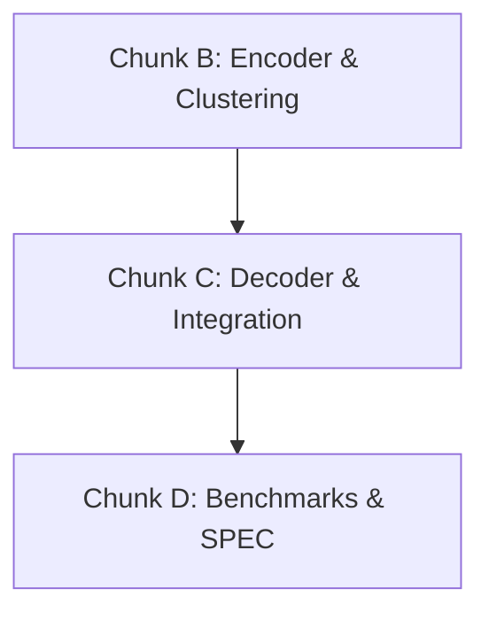

# FLUX v1.5 Context-Mapped Literal Coding Design Specification

This document details the architectural design for introducing context-mapped literal coding in FLUX v1.5. This feature is designed to bridge the compression ratio gap between FLUX and LZMA on executable code and prose, without resorting to slow bit-level coding.

---

## 1. Goals and Measurement Basis

### Core Objective
The primary goal of this feature is to close the compression ratio gap between FLUX and LZMA on executable binaries and natural language text (prose). Rather than implementing slow, bit-level range/rANS coding (which would severely degrade decompression speed), FLUX adopts byte-level context-mapped coding modeled after the Brotli algorithm (RFC 7932).

### Measurement Spike Findings
Our cheap measurement spike collected literal byte distributions and computed the theoretical Shannon entropy savings across representative test files:
* **flux-cli.exe**: 
  - **FULL** context mode (256 contexts) yields **0.85 bits/symbol** savings.
  - Literals represent **44%** of the compressed output.
  - The theoretical boundary predicts a **~5%** archive size improvement.
* **gutenberg.txt**:
  - Yields **0.86 bits/symbol** savings.
  - Literals represent **8.4%** of the compressed output.
  - Predicted archive improvement is **~1.4%**.
* **Source Code**:
  - Yields **0.81 bits/symbol** savings.
  - Literals represent **13.5%** of the compressed output.
  - Predicted archive improvement is **~2.4%**.
* **Structured / Numeric Data**:
  - Although context mapping shows high entropy drops, literals only constitute **5%** of the output in structured channels.
  - **Conclusion**: The additional metadata and table overhead is **NOT worth applying** to structured/numeric data.

### Realistic Ratio Expectations
Due to real-world rANS coding overhead (finite table resolution, quantization, and overhead of transmitting clustering tables and context maps), the actual gains will land at **70-90%** of the entropy-bound predictions.
* For executable binaries (`flux-cli.exe`), we predict a realistic **3.5% to 4.5%** archive size reduction in practice.

---

## 2. Sub-Block Format Additions

When context-mapped literal coding is active for a sub-block, the literal stream section is prefixed by formatting metadata before the rANS probability tables and the rANS-coded literal bytes.

### Byte-Level Layout
The serialized format of a context-mapped literal block is defined as follows:

| Field | Size (Bytes) | Type / Value | Description |
| :--- | :--- | :--- | :--- |
| `context_mode` | 1 | `u8` | Context mode: `0` = None (legacy), `1` = Full, `2` = Msb6, `3` = Lsb6 |
| `num_tables` | 1 | `u8` | Number of rANS frequency tables ($K \in [1..16]$, design specifies $2..8$ but allows up to 16) |
| `context_map` | `map_size` | `[u8; map_size]` | Maps each context ID to a table index in `0..num_tables-1`. Size is 256 bytes for Full, 64 for Msb6/Lsb6, and 0 for None. |
| `freq_tables` | `num_tables × 512` | `[u8]` | The serialized rANS frequency distributions (512 bytes per table) |
| `rans_payload` | Variable | `[u8]` | The rANS-encoded literal bitstream |

### Recording the Block-Level Flag
To indicate whether context coding is active on a block:
* **Option A**: A new bit in the sub-block header (per SPEC §3.5). This requires extending the 21-byte sub-block header with a new field or repurposing reserved space.
* **Option B (Chosen)**: A magic value in the existing `context_mode` byte where `context_mode = 0` (None) means "no context coding." 
* **Justification**: Option B is cleaner and more elegant. It requires no change to the 21-byte sub-block header. If `context_mode` is `0` (None), `num_tables` is implicitly 1, and `map_size` is 0. This matches the legacy format exactly, meaning we can write and parse blocks with zero context overhead by reusing the same deserialization logic.

### Backward Compatibility
* A v1.4 reader/decoder does not know how to parse the extra bytes (`context_mode`, `num_tables`, `context_map`) or multiple tables, and would misread the rANS starting position, causing a decoder crash or corruption.
* **Version Bump Rule**: The archive magic signature remains constant as `b"FLUX"` in the plaintext header (identifying the file format). The `version_minor` field in the plaintext header bumps from `4` to `5` **only** when context-mapped coding is actually used in at least one block in the archive.
* Archives in which no block uses context coding (i.e. all blocks use `context_mode = 0`) will remain at `version_minor = 4` (or lower, matching the established pattern of only bumping `version_minor` conditionally based on the features actually used in the archive).
* **Backward Compatibility Failure Path**:
  - A v1.4 reader sees the correct `b"FLUX"` magic bytes (so it knows it is a FLUX archive), reads `version_minor = 5` in the plaintext header, recognizes that the version is newer than what it supports, and returns `ErrUnsupportedFormat`.
  - This prevents magic signature mismatches and ensures a clean, meaningful error message ("unsupported version") rather than a misleading "not a FLUX archive" error.

---

## 3. Encoder Workflow

When context-mapped literal coding is enabled (at Maximum or Extreme compression levels), the encoder runs a multi-pass process for each sub-block:

```
[Pass 1: LZ77 Parse] ---> [Pass 2: Clustering (K=2..8)] ---> [Pass 3: Cost vs Overhead] ---> [Pass 4: Encode]
```

### PASS 1 — Statistics Gathering
1. Run the existing LZ77 parse to determine the exact sequence of literal symbols.
2. Track the post-transform reconstructed stream. For each literal symbol, retrieve the preceding byte (`prev_byte`) in the reconstructed output buffer.
3. For each candidate context mode (`Full`, `Msb6`, `Lsb6`), map the preceding byte to a `context_id` and construct a literal frequency histogram `H[context_id]`.

### PASS 2 — Clustering
For each candidate mode (`Full`, `Msb6`, `Lsb6`) and each candidate table count $K \in [2..8]$:
1. Group the active context histograms into $K$ clusters using **Greedy Agglomerative Merging**.
2. **Deterministic Clustering Algorithm**:
   - Start with each active `context_id`'s histogram as its own cluster.
   - For every pair of clusters $(c_1, c_2)$, calculate the information loss (entropy increase) if merged:
     $$\text{Loss}(c_1, c_2) = H(c_1 \cup c_2) \times N_{c_1 \cup c_2} - H(c_1) \times N_{c_1} - H(c_2) \times N_{c_2}$$
     where $H(c)$ is the Shannon entropy of the cluster distribution and $N_c$ is the total count of symbols in the cluster.
   - **Distance Metric Justification**: This metric directly computes the total bit-cost difference in coding the literals using a merged distribution versus separate ones. It matches our optimization target (minimizing output size) perfectly.
   - **Determinism**: In case of a tie in the minimal distance, merge the pair with the lowest starting `context_id` index.
   - Repeat the merging process until exactly $K$ clusters remain.
3. Map each `context_id` to its final cluster index to form the candidate `context_map`.
4. Calculate the total rANS bit-cost of encoding the block's literals under this clustering.

### PASS 3 — Cost vs. Overhead Decision
1. Compute the per-block overhead of introducing context coding:
   $$\text{Overhead} = 2 + \text{map\_size} + (K - 1) \times 512 \text{ bytes}$$
   *(The factor of $(K - 1)$ is used because a legacy single-table block already carries the cost of $1 \times 512$ bytes).*
2. Choose the best combination of `(mode, K)` that minimizes:
   $$\text{ContextCost} = \text{ClusteredBitCost} + \text{Overhead}$$
3. Compare `ContextCost` against the legacy single-table cost (`LegacyCost`).
4. If $\text{ContextCost} < \text{LegacyCost}$, enable context coding for the block, setting `context_mode` and `num_tables` = $K$. Otherwise, fall back to legacy `context_mode = None` and `num_tables = 1`.

### PASS 4 — Encode
1. Generate the $K$ quantized rANS frequency tables from the chosen clusters.
2. Write the context-mapped literal block header (metadata and tables).
3. Encode the literals using the rANS table corresponding to `context_map[context_id]`.

### Compression Levels & Routing
* **Speed Levels**: Tiny, Fast, and Balanced levels disable context coding entirely. The overhead of multi-pass clustering is not suitable for speed-oriented modes.
* **Ratio Levels**: Maximum and Extreme levels enable context coding.
* **Content Routing**:
  - **Executable, Text, Mixed/Other**: Candidates for context-mapped coding.
  - **Structured/Numeric Channels**: Context-mapped coding is skipped. Stride detection, Pearson correlation, or float channel split flags will automatically route these blocks to bypass context coding, as the literal counts are too low to offset the metadata overhead.

---

## 4. Decoder Workflow

The decoder remains simple and highly optimized for speed:

1. **Read `context_mode`**: Read the first byte of the literal stream.
2. **Branch on Mode**:
   - **`context_mode == None`**: Read one 512-byte frequency table, and decode the literal sequence using the legacy single-table path.
   - **`context_mode != None`**:
     1. Read `num_tables`.
     2. Read `map_size` bytes to populate the `context_map` array.
     3. Read `num_tables × 512` bytes to reconstruct the $K$ rANS frequency tables.
     4. Initialize the rANS decoder state.
     5. For each literal to decode:
        - Retrieve `prev_byte` from the decoded output buffer.
        - Compute the context ID: `context_id = get_context_id(context_mode, prev_byte)`.
        - Retrieve the table index: `table_index = context_map[context_id]`.
        - Decode the symbol using the rANS decoder and the table at `tables[table_index]`.

### Determinism and Speed
* The `context_map` is fully recovered from the serialized stream, eliminating any need for the decoder to replicate clustering.
* The only additional overhead is one byte-read from the decoded history buffer and one array indexing operation (`context_map[context_id]`) per literal. 
* The expected speed regression is **under 5%** on real archives, which is significantly faster than LZMA's bit-level decoding.

---

## 5. Optimal Parser Integration

FLUX's optimal parser (used at Maximum and Extreme levels) performs a shortest-path search through potential token graphs by pricing the bit-cost of literals and matches. 

### Pricing Approximation (Option A)
To avoid state space explosion or slow multi-pass pricing loops, FLUX uses **averaged literal costs** in the optimal parser:
1. Prior to optimal parsing, the encoder calculates the average bit cost of each literal byte $b$ across all contexts for the current block:
   $$\text{Price}(b) = \sum_{c} P(\text{context } c) \times \text{Price}(b \mid \text{context } c)$$
2. The optimal parser uses this average static price table for its path evaluations.
3. This approximation is simple, fast, and prevents the dynamic programming search from becoming context-state dependent. Option B (context-aware per-position pricing) is deferred to future releases.

---

## 6. Streams Scope

* **Literal Stream Only**: This specification covers only the **literal stream** within FLUX.
* **Other Streams**: Other streams (distance codes, length codes, repcode choices, run lengths) are encoded using their respective single-table formats and are out of scope for v1.5.
* Distance-by-length context mapping is deferred to v1.6.

---

## 7. Backward Compatibility Matrix

| Writer Version | Block Uses Context Coding | v1.4 Reader | v1.5 Reader |
| :--- | :--- | :--- | :--- |
| v1.4 | N/A | OK | OK |
| v1.5 | No (mode = None) | OK | OK |
| v1.5 | Yes (mode != None) | ErrUnsupportedFormat (version_minor mismatch) | OK |

The archive magic remains constant across FLUX versions; backward compatibility is enforced via the version_minor field per the established v1.3 and v1.4 pattern.

---

## 8. Implementation Chunks

After design approval, the feature will be implemented in three manageable steps:



### CHUNK B — Encoder Integration
* Implement the 4-pass block encoder.
* Implement the greedy agglomerative clustering algorithm with tie-breaking rules.
* Implement block-level decision logic (Pass 3 cost vs overhead check).
* Write the context coding metadata and multi-table byte serializer.
* Integrate archive magic selection (`b"FLX5"`) if context coding is active.
* Unit tests for clustering, cost evaluation, and block encoding.

### CHUNK C — Decoder Integration
* Implement the multi-table decoder path.
* Update `decompress_block` to support parsing multi-table headers and selective rANS decoding.
* Hook up Option A averaged literal pricing to the optimal parser.
* Add full roundtrip integration tests on small text/executable samples.

### CHUNK D — Benchmarks & Verification
* Run performance tests and verify target gains.
* Update `SPEC.md` with new format sections.
* Update `README.md` with new benchmark numbers.

---

## 9. Post-Implementation Measurement Plan

After completing all chunks, we will run benchmarks on a test suite:

### Compression Ratio
Compare FLUX v1.5 (with context coding), FLUX v1.4 (baseline), and 7-Zip `-mx=9` (LZMA reference):
* **`flux-cli.exe`**: Target ratio improvement from **2.612x** (v1.4) to **~2.75x** (v1.5).
* **Gutenberg Prose (`gutenberg.txt`)**: Target improvement from **3.30x** to **~3.35x**.
* **Mixed Corpus (`real_world_corpus.flx`)**: Target overall ratio improvement.
* **Regression Check**: Verify no ratio degradation on structured datasets (`coordinates_xyz`, `float64_scientific`).

### Compression and Decompression Speed
* **Compression Time**: Confirm that multi-pass clustering does not cause Maximum/Extreme levels to fall outside their expected speed profiles.
* **Decompression Speed**: Verify that the decompression speed regression remains **under 5%** compared to v1.4.

---

## 10. Risk Register

1. **Suboptimal Clustering**: Greedy agglomerative merging is a heuristic and might produce suboptimal clusters.
   - *Mitigation*: The Pass 3 cost evaluation acts as a safeguard. If clustering fails to yield a coding gain that covers the metadata overhead, the block falls back to legacy single-table mode.
2. **Small Block Overhead**: Small blocks will suffer from high overhead relative to literal savings.
   - *Mitigation*: Pass 3 overhead calculation automatically rejects context coding on small blocks.
3. **Encoder Speed Regression**: Clustering and multi-pass estimation add CPU cycles.
   - *Mitigation*: Context coding is disabled on speed-critical profiles (Tiny, Fast, Balanced), keeping them fast.
4. **Decompression Slowdown**: Extra memory lookups per literal could degrade decode speeds.
   - *Mitigation*: Keep the decoder array flat and context mapping simple. Roundtrip benchmarks will enforce a <5% slowdown limit.
5. **Structured Data opting in**: Pearson/stride detection might fail to classify some structured blocks, causing overhead waste.
   - *Mitigation*: Pass 3's cost vs. overhead decision logic operates block-by-block and will reject context mapping even if the block is routed as mixed/text, should the math show no net gain.

---

## 11. License and Credit

* **Algorithm Origin**: The context-mapped literal coding design is independent but based on understanding Brotli's published technique (RFC 7932).
* **Credits**: We credit Brotli, Jyrki Alakuijala, and Zoltán Szabadka in the eventual `SPEC.md` update.
* **Cleanroom Compliance**: No code has been copied from Brotli or any GPL/third-party codebase. FLUX's clean GPL/Commercial dual licensing structure remains fully intact.
